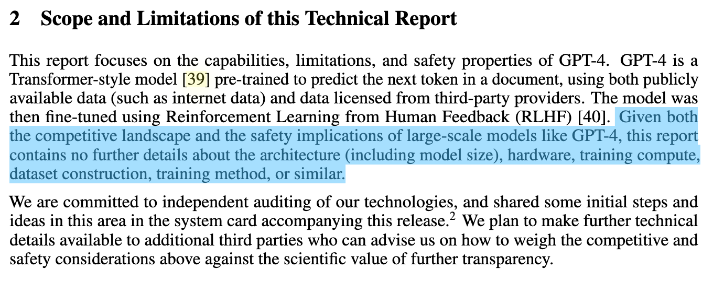
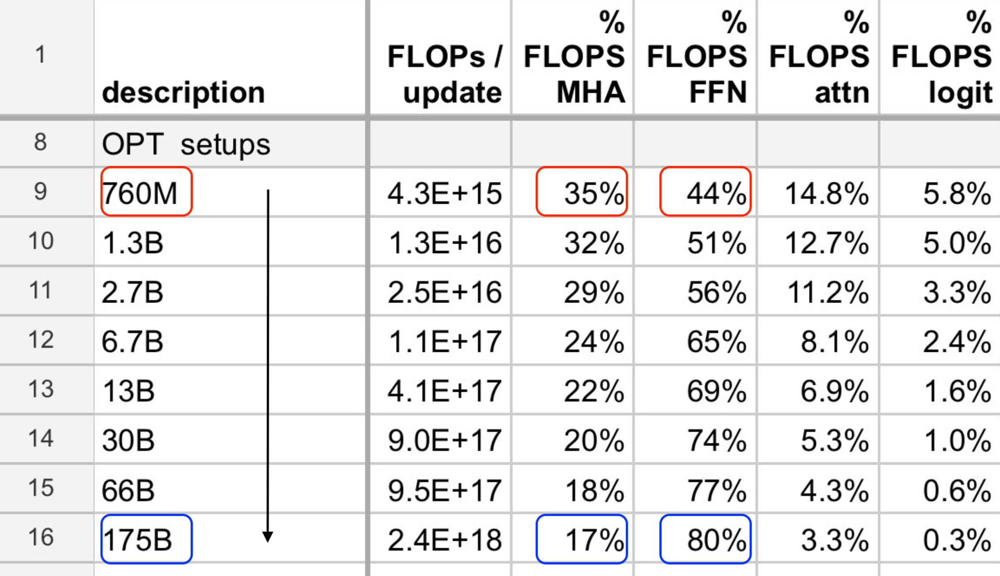
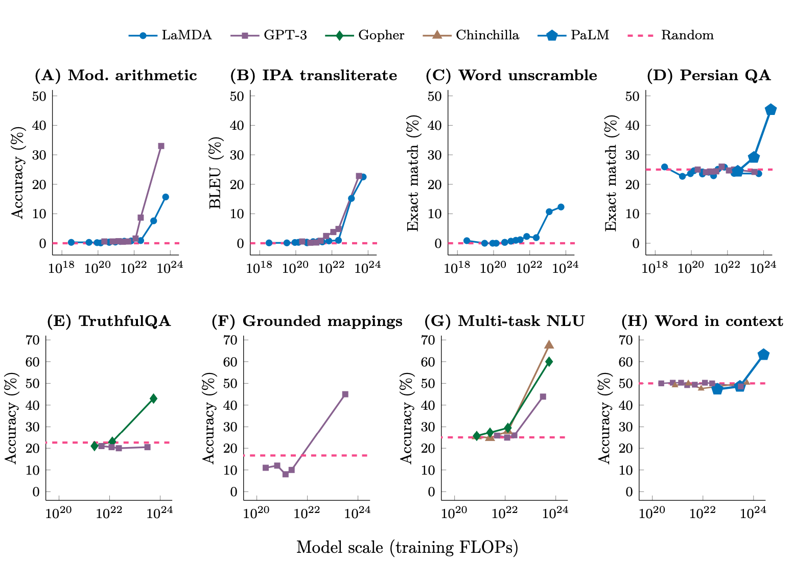

# Overview and Tokenization

### Why this course?

- **The "Crisis" in AI Research:** Researchers are increasingly disconnected from the underlying technology of AI models.

    - **Evolution of Interaction:**
        - 8 years ago (2017): Researchers implemented and trained their own models.
        - 6 years ago (2019): Downloaded and fine-tuned models (e.g., BERT).
        - Now (2025): Many rely solely on prompting proprietary models (e.g., GPT-4/Claude/Gemini).

- **Benefits of Abstraction:** Abstraction layers enable more people to do more research and simplify tasks, even for experienced researchers. *Abstraction in simple terms: it hides complex details and provides a simpler way to interact with something powerful. Example: you don't need to know how the engine works, or how the fuel ignites to drive a car. You just need to know how to use the steering wheel, pedals, and gear stick.* 

- **The Problem of "Leaky" Abstractions:** Unlike programming languages or operating systems, LLM abstractions are poorly understood (you **don't deeply understand _how_ the model processes information or why it produces specific outputs**) . They function as "string in, string out," without clear insight into their internal mechanisms.

- **Need for Fundamental Research:** A lot of fundamental research requires a deep understanding of the entire stack (data, systems, model) and the ability to co-design these aspects.

- **Course Philosophy:** The class exists to enable fundamental research. The core philosophy is: "To understand it, you have to build it."

---
### Industrialization of LLMs 

- **Massive Scale & Cost:** Frontier models like GPT-4 are rumored to have 1.8 trillion parameters and cost $100 million to train.

- **Enormous Infrastructure Investment:** Companies like xAI are building clusters with 200,000 H100 GPUs, with over $500 billion invested over four years.

- **Lack of Transparency:** There are no public details on how these frontier models are built, with companies citing competitive landscapes and safety limitations for non-disclosure.

From the GPT-4 technical report [OpenAI+ 2023](https://arxiv.org/pdf/2303.08774)

---
### Small Language Models (SLMs)

- **Reality Check:** Training "frontier" models (like GPT-4) is impossible for individuals due to compute costs.
    
- **The Strategy:** The course focuses on building **Small Language Models**, but with a warning: **small models are not always representative of large ones.**

### The Risks of Scaling "Blind Spots"

1. **Architectural Shifts (The FLOPs Distribution):**
    
    - In small models, compute (FLOPs) is split roughly equally between **Attention layers** and **MLP layers**. *FLOPs stands for Floating-point Operations - a way to measure the number of calculations a computer performs. In the context of language models, FLOPs count how many of these mathematical calculations are needed to train or run the model.*
        
    - In large models (e.g., 175B parameters), **MLPs dominate** the compute budget.
        
    - **The Danger:** You might waste time optimizing Attention at a small scale, only to find those optimizations are irrelevant at a larger scale where MLPs are the bottleneck.

Example: Fraction of FLOPs spent in attention versus MLP changes with scale.

2. **Emergent Behavior:**

	- Many capabilities (like **in-context learning**) do not appear linearly.
	    
	- Performance often stays at near-zero accuracy for a long time as compute increases, then suddenly spikes—a phenomenon known as **emergence**.
	    
	- **The Danger:** If you only study small scales, you might falsely conclude that a model or technique "doesn't work," simply because you haven't hit the required threshold for the behavior to emerge.

Example: Emergence of behavior with scale [Wei+ 2022](https://arxiv.org/pdf/2206.07682)

---
